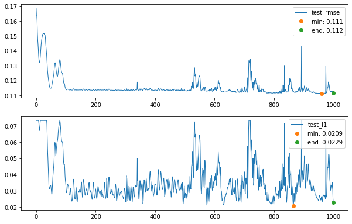
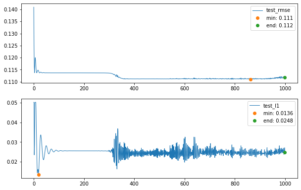
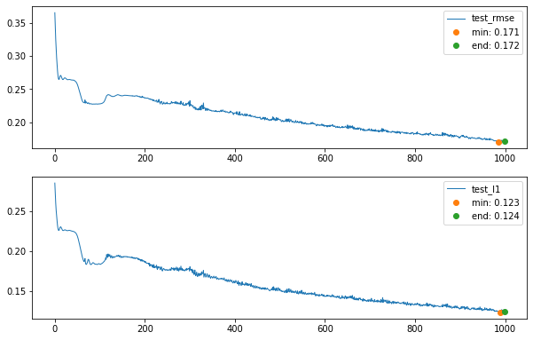
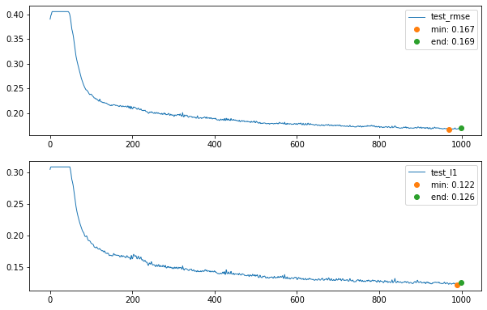
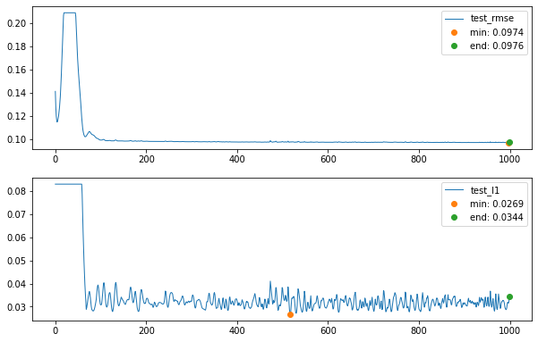

# Graph Data Mining - Handling sparse data inputs with missing values using graph representation learning
A tweaked version of GRAPE for handling missing values found in sparse data

## Intrduction 
The challenge of dealing with missing data attributes
has been a real-world problem for decades. The same becomes
even more challenging when the data is sparse in nature. We
have different approaches to deal with issue one of them being
the use of neural networks where data has representations in a
high dimensional space. One such model that leverage this idea
is GRAPE, which is a graph-based neural network framework
designed for performing feature imputation as well as label
prediction for the missing data. The motivation behind this
project is to see how well GRAPE works in case of sparse data
input and also to suggest some potential adjustments that can be
made to the GRAPE model for handling sparse data inputs.

## Some results on test datasets
I used the mean absolute error (MAE) and Root Mean
Squared Error (RMSE) for experimental evaluations. The
following visualizations show the behaviour of the MAE and
MSE when both the models i.e. original GRAPE and tweaked
version of GRAPE for sparse data is run for 1000 epochs.

### CORA 
#### Original 

#### Tweaked 


### CONCRETE 
#### Original 

#### Tweaked 


### REUTERS 
#### Original 

#### Tweaked 

## Original Work
Please see the original work at - http://snap.stanford.edu/grape/
<br>
Official GitHub (GRAPE) - https://github.com/maxiaoba/GRAPE
### Citation

## Links
You can cite their wonderful work-
```
@article{you2020handling,
  title={Handling Missing Data with Graph Representation Learning},
  author={You, Jiaxuan and Ma, Xiaobai and Ding, Daisy and Kochenderfer, Mykel and Leskovec, Jure},
  journal={NeurIPS},
  year={2020}
}
```

